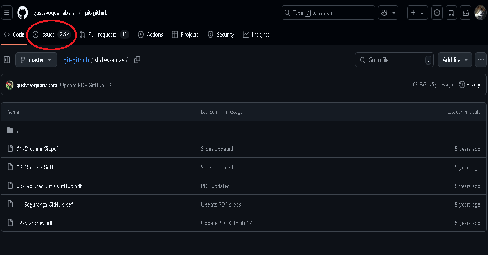

# ISSUES
## o que é ?
1. é um problema, uma questão que eu nao sei resolver;
2. usar de forma inteligente: pedir a resolução de um problema.
## mas e se eu souber resolver ?
1. clonar o código;
2. consigo resolver;
3. crio um fork;
4. resolvo na minha codificação;
5. e abro um **pull request**
## tente não criar uma issues duplicada!
1. sempre procure o erro que voce identificou, exemplo:
- erro no vscode ? vai no github da Microsoft;
- entre em "issues";
- busque pelo erro.
## mas e se eu nao achar uma resolução nas issues ?
### ai sim, você cria a sua! 
1. entre na pasta onde vc indentificou o erro:

2. escolha o arquivo:
 
3. vá em **"Issues"**;
